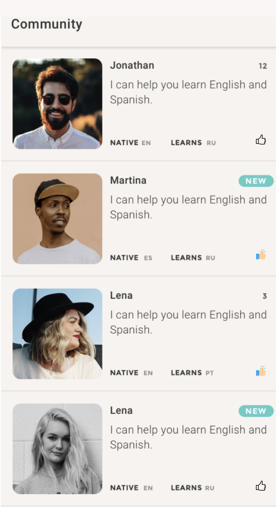

# Hiring challenge for new Android engineers

Thanks for applying to Tandem and going through the hiring steps with us so far. 

As a next step, we would like to get to know your development process a little better and invite you to a small developer challenge. 

Please read the task below and submit your final solution to us, complete with source code, documentation, test cases and anything required to build the solution. You may use any set of technologies you see fit, as long as it completes the desired task appropriately, we don’t want to limit your use of libraries or frameworks, but please remember that it’s your code we want to see! 

## The Task

Create an Android application that will get information about a language learning community and display the data in a view as you can see in the below screenshot. 

 

### The application:

* Make network calls to a remote API resource to fetch the community data from `https://tandem2019.web.app/api/community_{page}.json` where page is the pagination parameter starting at `1`. There are `20` community members per page. The last page has less than `20` members. The `referenceCnt=0` means the member is `new`.
* Like reaction: The default state of a community member is , and changes to  when the user clicks on the community card (and changes back to  when the user clicks on  This state should be persisted on the device and remains after relaunching the application. 
* Preferred tech stack: Kotlin, Jetpack, and Kotlin Coroutines

Please develop the application in a way that demonstrates your knowledge of Android SDK, testable clean code, clean architecture, reactive and "SOLID" design principles. Good test coverage is a big plus.

Please submit your project (including an .apk file) to a public GitHub repository, please add any comments / feedback in a README.md file

Good luck!
